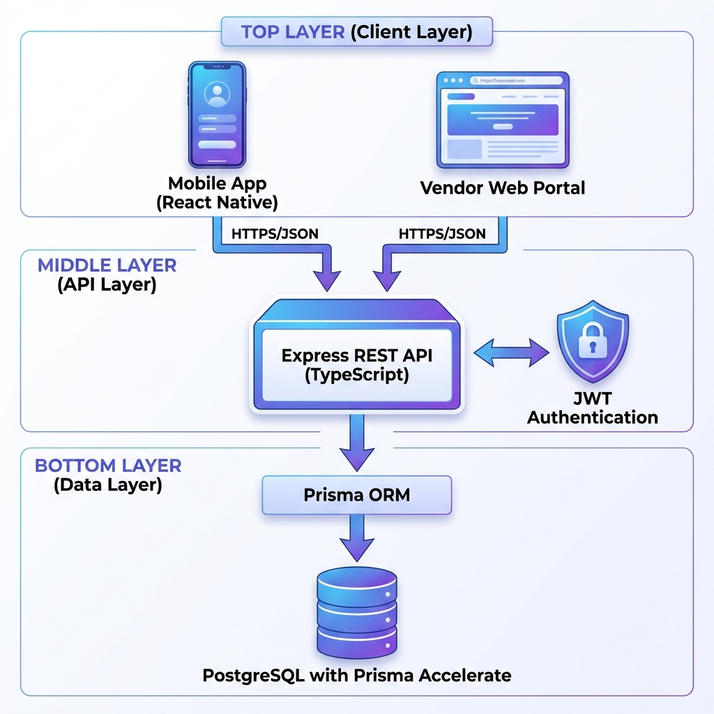
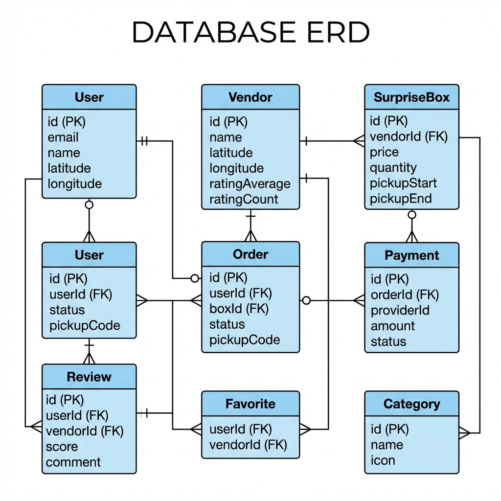

# System Architecture

## Transactional Push Notifications

The existing Firebase/Expo provider remains behind `sendPushNotification`.
Automatic triggers are currently limited to:

- A newly published offer notifying users who favorited its merchant
- Pickup reminders 1 hour and 15 minutes before `SurpriseBox.pickupStart`
- A one-time completion notification when an order becomes `COMPLETED`

Independent database timestamps prevent duplicate reminders and completion
messages across restarts. Timers re-check current status and pickup time before
delivery. Updating a listing pickup time reschedules active orders. Cancelled,
delivered, completed, or collected orders have their timers removed.

For local manual testing, run with `PICKUP_REMINDER_TEST_MODE=true` to use 2- and
1-minute offsets. This flag is ignored in production.

## High-Level Overview

---

## Database Architecture

---

## API Structure

### Authentication Endpoints
- `POST /api/auth/user/signup` - Customer registration
- `POST /api/auth/user/login` - Customer login
- `POST /api/auth/vendor/signup` - Vendor registration
- `POST /api/auth/vendor/login` - Vendor login

### Customer Endpoints (Planned)
- `GET /api/listings/nearby` - Browse nearby boxes
- `GET /api/listings/:id` - View box details
- `POST /api/orders` - Purchase box (initiate payment)
- `GET /api/orders` - View order history
- `POST /api/vendors/:id/favorite` - Toggle favorite
- `GET /api/vendors/:id/reviews` - View vendor reviews
- `POST /api/orders/:id/review` - Rate completed order

### Vendor Endpoints (Planned)
- `POST /api/vendor/boxes` - Create surprise box
- `GET /api/vendor/boxes` - List vendor's boxes
- `PATCH /api/vendor/boxes/:id` - Update box
- `GET /api/vendor/orders` - View orders
- `PATCH /api/vendor/orders/:id/collect` - Mark collected

---

## Technology Stack

### Backend
- **Runtime:** Node.js 20+
- **Language:** TypeScript
- **Framework:** Express.js
- **ORM:** Prisma 7
- **Database:** PostgreSQL (Prisma Accelerate)
- **Auth:** JWT + bcrypt
- **Validation:** Zod (type-safe schemas)
- **Package Manager:** Yarn

### Mobile (Planned)
- **Framework:** React Native (Expo)
- **Navigation:** React Navigation
- **HTTP Client:** Axios
- **State Management:** React Query + Zustand
  - **React Query:** Server state (API data, caching, sync)
  - **Zustand:** Client state (UI, auth token, user preferences)
- **Validation:** Zod (shared schemas with backend)
- **UI Library:** TBD (pending design review)

### Vendor Portal (Future)
- **Framework:** Next.js / React
- **UI Library:** TBD

---

## Security Considerations

1. **Password Hashing:** bcrypt with salt rounds = 10
2. **JWT Tokens:** 7-day expiry for users, 1-day for vendors
3. **Environment Variables:** Sensitive data in `.env` (gitignored)
4. **HTTPS Only:** Production deployment
5. **Input Validation:** TBD (express-validator)

---

## Scalability Strategy

1. **Database:** Prisma Accelerate for connection pooling + global cache
2. **API:** Stateless design for horizontal scaling
3. **Geolocation:** Indexed lat/long for fast nearby queries
4. **Caching:** Redis for frequently accessed data (future)
