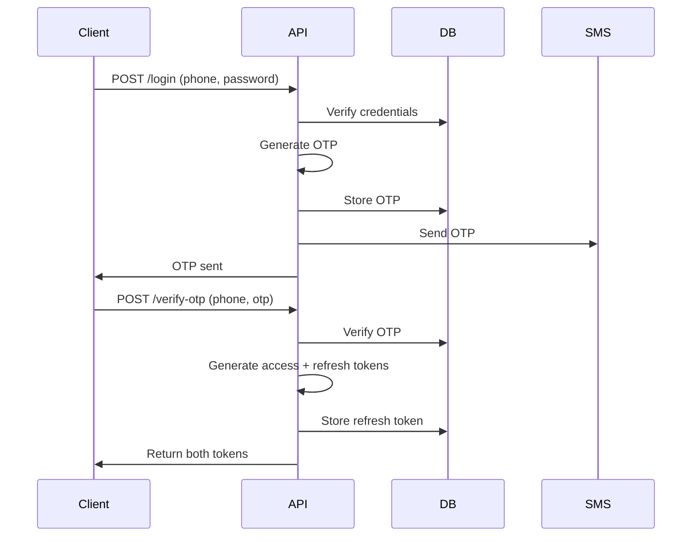
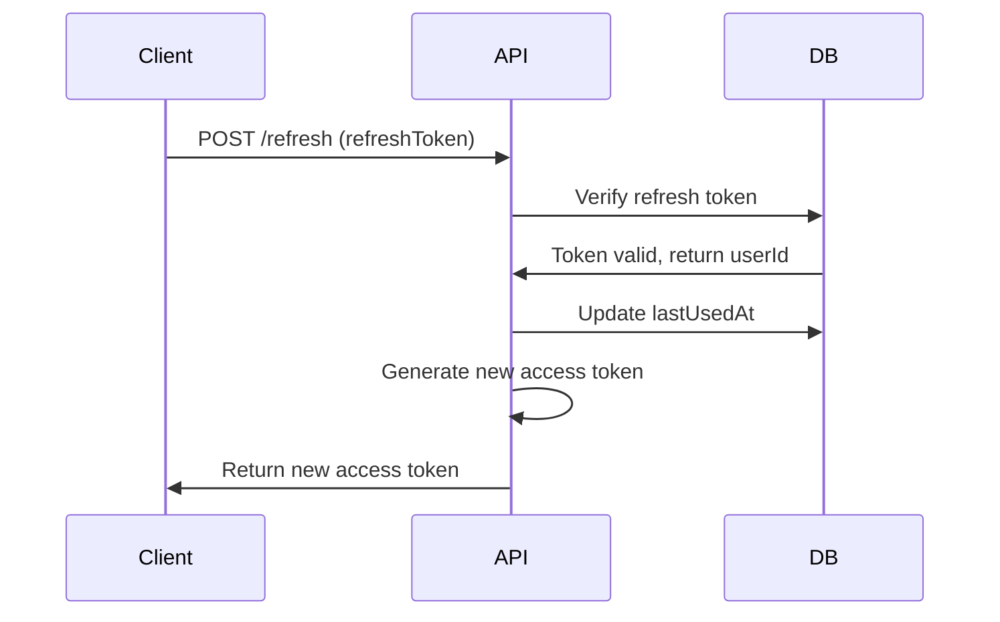
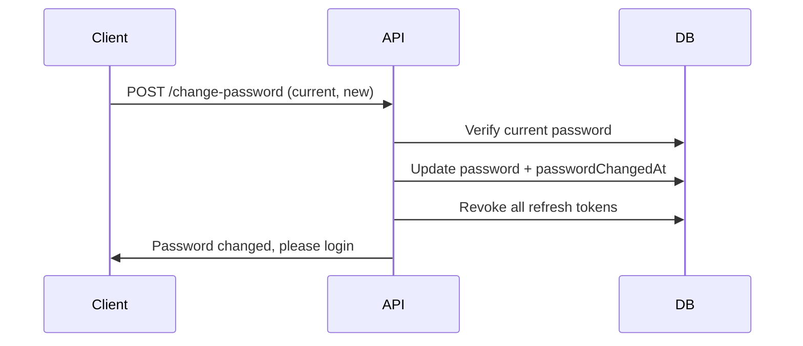
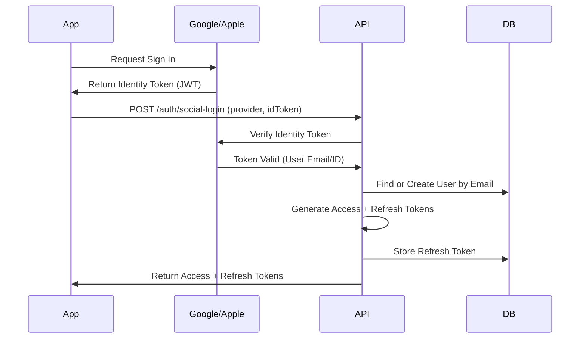

# JWT Token Management Implementation - Walkthrough

## Overview

Successfully implemented a robust JWT token management system with the following features:
- **Dual-token approach**: Short-lived access tokens (15 min) + long-lived refresh tokens (7 days)
- **Database-backed token metadata**: Refresh tokens stored in database for session management
- **Token invalidation**: Automatic invalidation when users change passwords
- **Multi-device support**: Users can have multiple active sessions
- **Session management**: Logout specific sessions or all sessions

---

## Changes Made

### 1. Database Schema Updates

#### Added RefreshToken Model

[schema.prisma](file:///Users/karim/Desktop/Mismish/Mismish/backend/prisma/schema.prisma)

```prisma
model RefreshToken {
  id          Int      @id @default(autoincrement())
  token       String   @unique
  userId      Int
  user        User     @relation(fields: [userId], references: [id], onDelete: Cascade)
  expiresAt   DateTime
  createdAt   DateTime @default(now())
  lastUsedAt  DateTime @default(now())
  deviceInfo  String?  // Tracks user-agent
  ipAddress   String?  // Tracks IP address
  isRevoked   Boolean  @default(false)
  
  @@index([userId])
  @@index([token])
}
```

#### Updated User Model

Added two new fields to the `User` model:
- `passwordChangedAt`: Timestamp for tracking password changes
- `refreshTokens`: Relation to RefreshToken model

---

### 2. Token Service Utility

#### Created [token.service.ts](file:///Users/karim/Desktop/Mismish/Mismish/backend/src/api/shared/utils/token.service.ts)

A comprehensive token management service with the following functions:

**Token Generation:**
- `generateAccessToken()`: Creates short-lived JWT (15 minutes)
- `generateRefreshToken()`: Creates cryptographically secure random token
- `createRefreshTokenRecord()`: Stores refresh token in database with metadata

**Token Validation:**
- `verifyAccessToken()`: Validates JWT signature and expiration
- `verifyRefreshToken()`: Checks database validity, expiration, and revocation status
- `isTokenValidAfterPasswordChange()`: Verifies token wasn't issued before password change

**Token Invalidation:**
- `revokeRefreshToken()`: Revokes a specific token (logout)
- `revokeAllUserTokens()`: Revokes all user tokens (password change)
- `cleanupExpiredTokens()`: Removes expired tokens (for cron jobs)

**Session Management:**
- `getUserActiveSessions()`: Lists all active sessions for a user

---

### 3. Authentication Controller Updates

#### Updated [auth.controller.ts](file:///Users/karim/Desktop/Mismish/Mismish/backend/src/api/customer/auth/auth.controller.ts)

**Modified `verifyOTP` function:**
- Now generates both access and refresh tokens
- Stores refresh token in database with device info and IP address
- Returns both tokens to client

**Added new endpoints:**

1. **`refreshAccessToken`**: Refreshes expired access tokens
   - Validates refresh token from database
   - Generates new access token
   - Updates `lastUsedAt` timestamp

2. **`logout`**: Revokes a specific refresh token
   - Marks token as revoked in database
   - Allows user to logout from specific device

3. **`changePassword`**: Changes user password
   - Verifies current password
   - Updates password with new hash
   - Sets `passwordChangedAt` timestamp
   - Revokes all refresh tokens (forces re-login on all devices)

---

### 4. Validation Schemas

#### Updated [authSchemas.ts](file:///Users/karim/Desktop/Mismish/Mismish/backend/src/api/shared/schemas/authSchemas.ts)

Added Zod validation schemas for new endpoints:
- `RefreshTokenSchema`: Validates refresh token requests
- `LogoutSchema`: Validates logout requests
- `ChangePasswordSchema`: Validates password change requests (min 8 characters)

---

### 5. Route Updates

#### Updated [authRoutes.ts](file:///Users/karim/Desktop/Mismish/Mismish/backend/src/routes/customer/authRoutes.ts)

Added new routes:
- `POST /api/auth/user/refresh`: Refresh access token
- `POST /api/auth/user/logout`: Logout (revoke refresh token)
- `POST /api/auth/user/change-password`: Change password (requires authentication)

---

## API Endpoints

### Public Endpoints

#### 1. Register User
```http
POST /api/auth/user/signup
Content-Type: application/json

{
  "phoneNumber": "+201234567890",
  "password": "password123",
  "name": "John Doe",
  "address": "123 Main St",
  "latitude": 30.0444,
  "longitude": 31.2357
}
```

#### 2. Login (Send OTP)
```http
POST /api/auth/user/login
Content-Type: application/json

{
  "phoneNumber": "+201234567890",
  "password": "password123"
}
```

#### 3. Verify OTP (Get Tokens)
```http
POST /api/auth/user/verify-otp
Content-Type: application/json

{
  "phoneNumber": "+201234567890",
  "otp": "123456"
}
```

**Response:**
```json
{
  "status": "success",
  "data": {
    "accessToken": "eyJhbGciOiJIUzI1NiIsInR5cCI6IkpXVCJ9...",
    "refreshToken": "a1b2c3d4e5f6...",
    "user": {
      "id": 1,
      "phoneNumber": "+201234567890",
      "name": "John Doe",
      "isVerified": true
    }
  }
}
```

#### 4. Refresh Access Token
```http
POST /api/auth/user/refresh
Content-Type: application/json

{
  "refreshToken": "a1b2c3d4e5f6..."
}
```

**Response:**
```json
{
  "status": "success",
  "data": {
    "accessToken": "eyJhbGciOiJIUzI1NiIsInR5cCI6IkpXVCJ9..."
  }
}
```

#### 5. Logout
```http
POST /api/auth/user/logout
Content-Type: application/json

{
  "refreshToken": "a1b2c3d4e5f6..."
}
```

### Protected Endpoints

#### 6. Change Password
```http
POST /api/auth/user/change-password
Authorization: Bearer <access_token>
Content-Type: application/json

{
  "currentPassword": "password123",
  "newPassword": "newpassword456"
}
```

---

## Token Flow

### Initial Login Flow



### Token Refresh Flow



### Password Change Flow



### Social Login Flow (Google/Apple)



**Key Concept: Native Token Exchange**
1. **Client-Side**: The mobile uses native SDKs (`expo-apple-authentication`, `google-signin`) to authenticate the user directly with the provider.
2. **Token Handoff**: The app receives a proof-of-identity (Identity Token) from the provider.
3. **Backend Verification**: This token is sent to the Mismish backend. The backend verifies the token's signature against the provider's public keys (no passwords involved).
4. **Session Creation**: Once verified, the backend issues our standard `accessToken` and `refreshToken` pair, treating the user exactly like a password-authenticated user.

---

## Security Features

### 1. Token Expiration
- **Access tokens**: 15 minutes (short-lived, stateless)
- **Refresh tokens**: 7 days (long-lived, database-backed)

### 2. Token Invalidation
- All refresh tokens are invalidated when password changes
- Access tokens expire naturally (max 15 min after password change)

### 3. Session Tracking
- Device info (user-agent) stored with each refresh token
- IP address tracked for security auditing
- `lastUsedAt` timestamp updated on each use

### 4. Database Cleanup
- `cleanupExpiredTokens()` function available for cron jobs
- Automatically removes expired tokens from database

---

## Breaking Changes

> [!WARNING]
> **Mobile App Update Required**
> 
> The login response format has changed:

**Old format:**
```json
{
  "token": "..."
}
```

**New format:**
```json
{
  "accessToken": "...",
  "refreshToken": "..."
}
```

**Mobile app must:**
1. Store both tokens securely
2. Use `accessToken` for API requests (Authorization header)
3. Use `refreshToken` to get new access tokens when expired
4. Handle 401 errors by refreshing the token

---

## Testing Results

### ✅ Server Startup
- Server started successfully on port 3000
- Database connection established
- All routes registered correctly

### 🔄 Pending Manual Tests

The following scenarios should be tested:

1. **Login and Token Generation**
   - Register new user
   - Login with credentials
   - Verify OTP
   - Confirm both tokens are returned

2. **Token Refresh**
   - Wait for access token to expire (15 min) or manually test
   - Use refresh token to get new access token
   - Verify new access token works

3. **Password Change**
   - Change password while logged in
   - Verify old refresh token no longer works
   - Login with new password
   - Verify new tokens are issued

4. **Logout**
   - Login from multiple devices (simulate with different user-agents)
   - Logout from one device
   - Verify that device's token is revoked
   - Verify other devices still work

5. **Multi-Device Sessions**
   - Login from multiple devices
   - Verify all sessions are tracked
   - Change password
   - Verify all sessions are invalidated

---

## Next Steps

### Immediate
1. Update mobile app to handle new token format
2. Implement token refresh logic in mobile app
3. Test all authentication flows end-to-end

### Future Enhancements
1. **Session Management UI**: Allow users to view and revoke active sessions
2. **Token Rotation**: Rotate refresh tokens on each use for enhanced security
3. **Rate Limiting**: Add rate limiting to refresh endpoint
4. **Suspicious Activity Detection**: Alert users of logins from new devices/locations
5. **Cron Job**: Set up automated cleanup of expired tokens

---

## Files Modified

### Database
- [schema.prisma](file:///Users/karim/Desktop/Mismish/Mismish/backend/prisma/schema.prisma) - Added RefreshToken model and passwordChangedAt field

### Services
- [token.service.ts](file:///Users/karim/Desktop/Mismish/Mismish/backend/src/api/shared/utils/token.service.ts) - New token management service

### Controllers
- [auth.controller.ts](file:///Users/karim/Desktop/Mismish/Mismish/backend/src/api/customer/auth/auth.controller.ts) - Updated verifyOTP, added refresh, logout, changePassword

### Types
- [auth.types.ts](file:///Users/karim/Desktop/Mismish/Mismish/backend/src/api/customer/auth/types/auth.types.ts) - Added new request body types

### Schemas
- [authSchemas.ts](file:///Users/karim/Desktop/Mismish/Mismish/backend/src/api/shared/schemas/authSchemas.ts) - Added validation schemas

### Routes
- [authRoutes.ts](file:///Users/karim/Desktop/Mismish/Mismish/backend/src/routes/customer/authRoutes.ts) - Added new routes

### Exports
- [utils/index.ts](file:///Users/karim/Desktop/Mismish/Mismish/backend/src/api/shared/utils/index.ts) - Exported token service


### Images 

#### Token Flow


#### Token Refresh Flow


#### Password Change Flow

